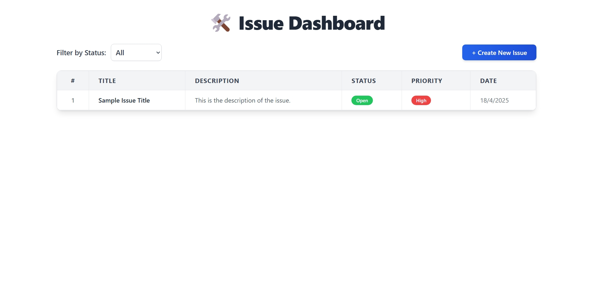
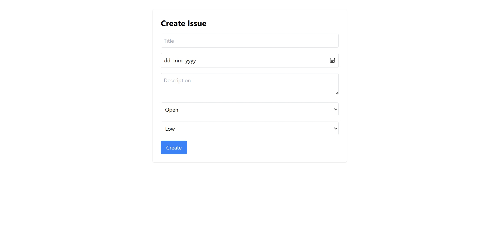

# 🐛 Issue Tracker Web Application

A full-stack Issue Tracker built with **React (Vite)** and **Node.js + Express + MongoDB**, designed to help teams efficiently create, manage, and resolve issues.

---

## 🚀 Project Description

The **Issue Tracker** is a web-based application that allows users to:

- Create, view, update, and delete issues.
- Track the status of each issue.
- Ensure smooth issue management within teams or organizations.

This app features a modern frontend using **React.js** (with Vite for fast builds and HMR) and a robust backend powered by **Node.js**, **Express**, and **MongoDB**.

---

## 🧰 Technologies Used

### Frontend:
- React.js (Vite)
- Axios
- React Router DOM
- MUI (Material-UI)
- useReducer (React hook for state management)

### Backend:
- Node.js
- Express.js
- MongoDB (Mongoose)
- CORS
- dotenv

---

## 📦 Installation Instructions

### 🔁 Clone the Repository

```bash
git clone https://github.com/santuguddu/issue-tracker.git
cd issue-tracker


📁 Install Dependencies

Frontend :
cd frontend
npm install

Backend :
cd ../backend
npm install


Root (to install concurrently) :

cd ..
npm install --save-dev concurrently


⚙️ Environment Setup
Create a .env file inside the backend/ directory with the following content:
PORT=5000
MONGO_URI=your_mongodb_connection_url

🔑 Evaluator: Just replace your_mongodb_connection_url with your MongoDB Atlas connection string.


📚 Necessary Libraries
Frontend Libraries :
npm install react react-dom react-router-dom
npm install axios
npm install @mui/material @emotion/react @emotion/styled
npm install react-use-reducer

Backend Libraries :
npm install express
npm install mongoose
npm install cors
npm install dotenv

🏃‍♂️ Run the Project
From the root of the project, run:

npm start


## 📸 Screenshots

### 🏠 Dashboard  


### ✍️ Create Issue  


### 📋 Issue Details  


✅ Summary
This project is designed for easy evaluation and setup.

Clone the repo

Install dependencies

Add your MongoDB URI in .env

Run with npm start

Explore the app in your browser!

👉 Evaluator Tip: Just replace the MongoDB URL in .env and everything will work perfectly!

